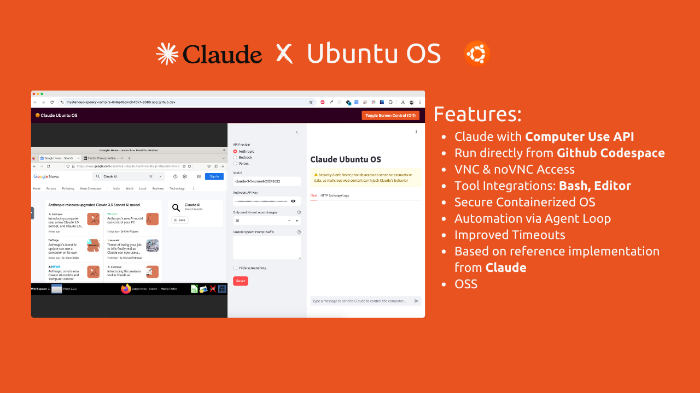

# Claude Ubuntu OS

Claude Ubuntu OS integrates Claude's Computer Use API with Ubuntu, enabling AI-powered control over desktop environments. The upgraded Claude 3.5 Sonnet model introduces the ability to manipulate virtual machines or containerized desktops with security and isolation in mind. It provides seamless interaction with desktop tasks, making automation, management, and complex workflows more efficient and intelligent.

With Claude Ubuntu OS, you can execute commands, interact with user interfaces, manipulate files, and more, all under the watchful eye of Claude’s enhanced AI capabilities. This project offers a versatile, sandboxed environment where you can test and run various AI-driven desktop operations, mitigating risks through secure isolation.



## Key Features

- **VNC Desktop Access**: Remotely access and control desktop environments using VNC.
- **Tool Integration**: Supports multiple Anthropic-defined tools like `computer`, `bash`, and `text_editor` to enhance productivity.
- **Agent Loop**: Automates tasks using an intelligent agent loop that evaluates outcomes before proceeding.
- **Security-Focused**: Runs in isolated virtual machines or containers to protect sensitive data and prevent unauthorized access.
- **Extensible**: Easily extendable with additional tools and scripts for custom workflows.
- **Interactive AI**: Claude intelligently decides and executes desktop tasks, offering automation with human oversight.

---

## Demo

Here's a quick demo of Claude Ubuntu OS in action:


---

## Getting Started in GitHub Codespaces

You can run **Claude Ubuntu OS** in GitHub Codespaces, providing a quick way to test and run this project in the cloud.

[](https://github.com/codespaces/new?repository=Justmalhar/claude-ubuntu-os)


### Prerequisites

- **GitHub Account** (for accessing GitHub Codespaces)
- **Docker** (pre-installed in the Codespaces environment)
- **Anthropic API Key** (for Claude’s API)

### Running Pre-built Docker Image in GitHub Codespaces

To run the pre-built Docker image, follow these steps:

1. **Open the Repository in Codespaces**:
   - Go to the [repository](https://github.com/Justmalhar/claude-ubuntu-os) on GitHub.
   - Click the **Code** button and select **Codespaces**.
   - Click **Create codespace on main**. This will create and launch the repository inside a new Codespace.

2. **Set Up Anthropic API Key**:
   - Inside the Codespaces terminal, export your Anthropic API key:
     ```bash
     export ANTHROPIC_API_KEY=your_api_key
     ```

3. **Pull and Run the Docker Image from Docker Hub**:
   Run the following commands in the Codespaces terminal to pull and run the pre-built Docker image from Docker Hub:
   ```bash
   docker pull justmalhar/claude-ubuntu-os:latest && docker run -e ANTHROPIC_API_KEY=$ANTHROPIC_API_KEY -p 8080:8080 -p 6080:6080 -p 8501:8501 justmalhar/claude-ubuntu-os:latest
   ```

4. **Access the Desktop Environment**:
   - Codespaces automatically exposes ports. Once the container is running, go to the **Ports** tab in your Codespace, where you’ll see the ports (`8080`, `6080`, and `8501`) listed.
   - You can then click on the provided URLs to access the desktop interface via **noVNC** and **Streamlit**.

### Usage

1. **Access the Desktop**:
   - Use a VNC client to connect to the VNC server on port `6080`.
   - Alternatively, open a browser and navigate to `https://<your-app-name>.github.dev:8080` to access the desktop via noVNC.

2. **Interact with the Desktop**:
   Once connected, you can send commands to Claude for execution. Example use cases include:
   - Running shell commands via the `bash` tool.
   - Opening and editing files with the `text_editor` tool.
   - Interacting with desktop applications using the `computer` tool.

3. **Agent Loop**:
   Claude will evaluate the results of executed tasks and continue calling tools as needed until the task is complete. This loop ensures that operations are executed step by step, with accuracy.


### Security Considerations

- **Run in an Isolated Environment**: Always run Claude Ubuntu OS in a secure, containerized, or virtualized environment to prevent direct access to your host system.
- **Sensitive Data Protection**: Do not give the AI access to sensitive data or login credentials.
- **Limit Network Exposure**: Restrict internet access and only allow trusted domains to minimize the risk of malicious content.

---

## Contributing

Feel free to submit issues and pull requests to improve Claude Ubuntu OS. Contributions that enhance security, performance, or extend tool support are especially welcome.

1. Fork the repository
2. Create a new branch (`git checkout -b feature-branch`)
3. Make your changes
4. Commit and push your changes (`git push origin feature-branch`)
5. Open a pull request

---

## License

Claude Ubuntu OS is licensed under the MIT License. See the [LICENSE](LICENSE) file for more details.

---

## Credits

This project is inspired by and based on the [Anthropic Computer Use Demo](https://github.com/anthropics/anthropic-quickstarts/tree/main/computer-use-demo). Special thanks to Anthropic for providing the reference implementation and tools for enabling AI-powered desktop control.
